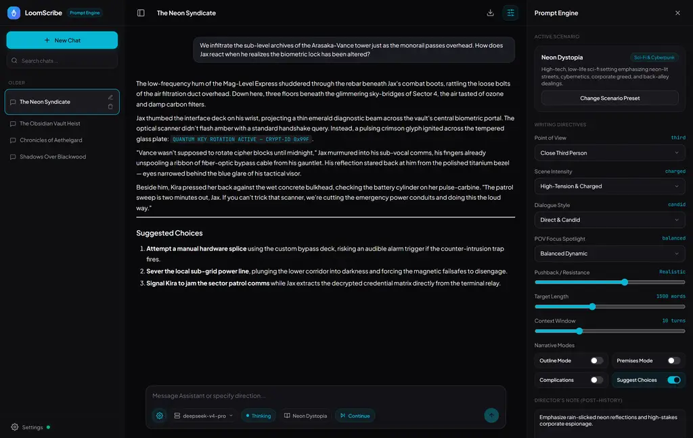
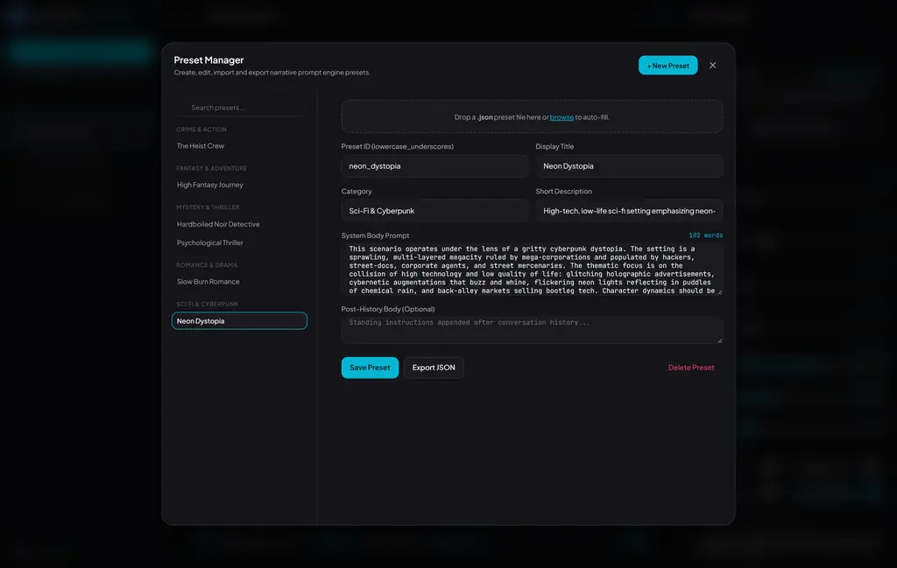
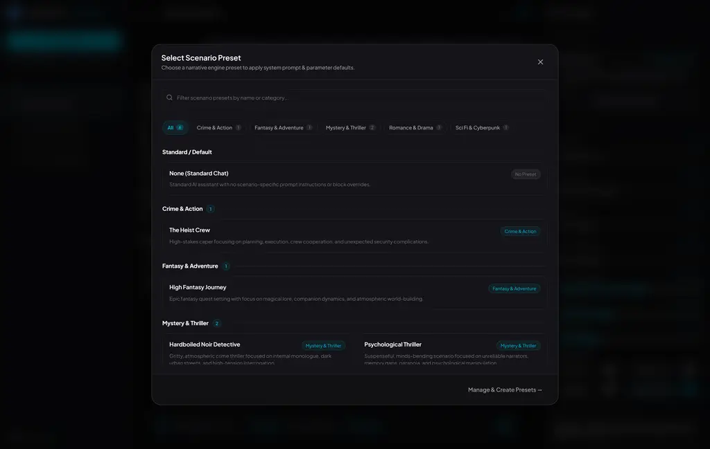
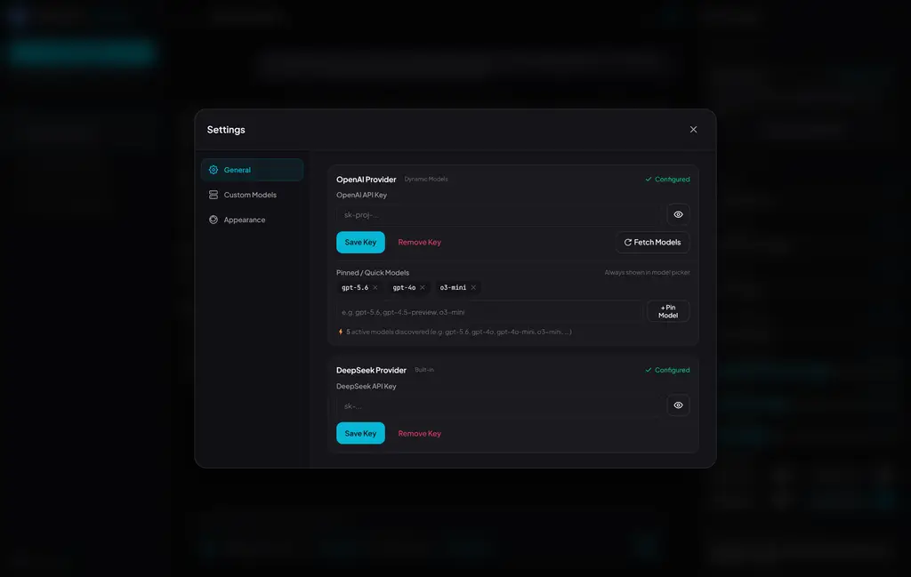

# 🌌 LoomScribe

LoomScribe is a premium, highly specialized creative writing workspace designed specifically for DeepSeek and OpenAI-compatible models. It provides a dual-slot compiler architecture that maximizes API cache performance while putting granular writing controls (POV, scene intensity, dialogue style, character focus, pushback resistance, complications, outline sandbox mode, and premises generation mode) directly in your hands.

Built with a lightweight Node.js/Express backend and a responsive, zero-build vanilla HTML/CSS/JS frontend, LoomScribe serves as a distraction-free desktop environment for drafting, brainstorming, and editing interactive fiction.

---

## 🖼️ User Interface Preview

| Main Workspace & Prompt Controls | Interactive Preset Manager |
| :---: | :---: |
|  |  |

| Genre Scenario Picker | Custom Models & Endpoint Config |
| :---: | :---: |
|  |  |

---

## ✨ Core Features

### 🧠 DeepSeek Optimization & Dual-Slot Prompting
DeepSeek models utilize a key-value (KV) cache of the prefix prompt. To prevent cache-busting, LoomScribe compiles your prompt into two distinct slots:
*   **Slot 1 (System Prompt - Stable)**: Contains the foundational character, prose, tone, and formatting rules. This stays byte-for-byte identical across turns to maximize cache hits, reducing cost and latency.
*   **Slot 2 (Post-History - Dynamic)**: Injected *after* all chat history, immediately before the model generates. This holds dynamic turn-based instructions such as word count targets, complications, choice suggestions, and the Director's Note. Changes here never bust the cache.

### 🎛️ Dynamic Configuration Panel (Right Pane)
Loaded directly from a central JSON schema, the right pane provides a live suite of parameters:
*   **System-Slot Controls (Busts Cache - Amber Warning Dot)**:
    *   **Point of View**: Toggle between *Close Third*, *Deep First*, and *Omniscient* POV blocks.
    *   **Scene Intensity**: Select narrative pacing and emotional charge (*Tender*, *Sensory*, *Charged*, or *Raw*).
    *   **Dialogue Style**: Configure speech dynamics (*Silent / Subtext*, *Playful / Witty*, *Candid*, or *Commanding*).
    *   **POV Focus Spotlight**: Shift perspective balance (*Balanced*, *Self / Interiority*, or *Partner Reactions*).
    *   **Outline / Brainstorm Mode**: Switch the model into planning mode instead of full prose.
    *   **Premises & Ideas Mode**: Switch the model into six-premise generation mode instead of prose.
*   **Post-History Controls (Cache Safe)**:
    *   **Response Length**: Slider targeting a word count between 600 and 3,000 words.
    *   **Context Window**: Sliding window slider to configure active turn history (2 to 30 turns).
    *   **Pushback / Resistance**: Control character compliance vs resistance levels (0 to 5).
    *   **Complication Generator**: Toggle to introduce sudden external obstacles, interruptions, emotional ruptures, or power shifts.
    *   **Suggest Next Choices**: Toggle to force the model to provide three continuation choices at the end of the response.
    *   **Director's Note**: Per-turn free text (e.g., `"Focus on the rain sound; build slow tension"`) appended at high recency.
*   **Advanced Block Overrides**: Manually override individual system-prompt markdown files inside your preset.
*   **Live Prompt Compiler Preview**: View compiled Slot 1 and Slot 2 prompt states in real-time.

### 📁 Interactive Preset Manager
A built-in preset manager interface allows you to create, edit, duplicate, delete, and import narrative presets directly.
*   **Two-Column Editor**: Modify system body prompts, metadata, categories, and parameter overrides.
*   **File Dropzone**: Drag and drop JSON preset files to import them instantly.
*   **Server CRUD Endpoints**: Fully backed by API routes for managing local presets on the fly.

### 📐 Outline & Brainstorm Mode
A dedicated toggle shifts LoomScribe from prose drafting into a planning sandbox. Enabling Outline Mode disables the prose-focused blocks, then injects directives that ask the model to expand on plot structure, scene beats, and character trajectories instead of writing finished chapters.

### 🧩 Premises & Ideas Mode
A separate toggle switches the engine into a six-premise brainstorming mode. When enabled, the compiler disables prose-focused blocks and appends a directive that asks the model to generate exactly six fully developed premises, each with a distinct tonal lane and a clear conflict axis.

### 🔌 Custom Endpoints & Local LLMs
Connect to any OpenAI-compatible API endpoint directly from the UI:
*   **Custom Models**: Configure custom providers like Ollama, vLLM, LM Studio, or OpenRouter with custom model IDs and base URLs (e.g. `http://localhost:11434/v1`).
*   **Per-Model Authentication**: Store dedicated API keys per custom endpoint.
*   **Smart Payload Formatting**: Automatically strips proprietary DeepSeek `thinking` parameters when routing to standard third-party backends.

### 🔒 Password Authentication
Protect your remote or shared instance with optional password authentication:
*   Set `APP_PASSWORD` in your `.env` file to enable a sleek sign-in screen.
*   Secure token verification across all API endpoints and WebSocket streams.
*   Leave `APP_PASSWORD` blank to disable authentication for frictionless local development.

### ⚡ Concurrency & Multi-Threaded Streaming
Switch between chat threads while other responses stream in the background. Generating threads show a pulsing `⚡` status dot in the sidebar and rebuild cleanly when revisited. Streaming runs over WebSockets, providing robust reconnects, background updates, and per-thread aborts.

### 🧷 Message Actions & Draft Recovery
Each message has quick actions for editing, regenerating, and copying raw content to the clipboard. User input drafts are preserved per conversation, so switching threads or refreshing the app does not wipe your draft.

### 🌿 Version Navigation & Sibling Trees
LoomScribe tracks conversation history as a branching version tree. Inline editing of any user message branches a new lineage, and prev/next controls let you move between alternative timelines, drafts, and regenerations.

### 📊 Structured JSON Logging
A server-side logger format writes HTTP requests, WebSocket connection updates, and prompt compilation details as structured JSON events. Configure the log verbosity via the `LOG_LEVEL` environment variable.

---

## 🚀 Desktop Quick Start

### Prerequisites
Make sure you have [Node.js](https://nodejs.org/) installed (LoomScribe works on any recent LTS version).

### 1. Installation
Clone the repository and install the dependencies:
```bash
npm install
```

### 2. Configuration
Copy the template environment file:
```bash
cp .env.example .env
```
Open `.env` and configure your settings:
*   `PORT`: Port to host the app (defaults to `3000`).
*   `DEEPSEEK_API_KEY`: Optional server-side DeepSeek API key (can also be configured in the UI Settings modal).
*   `APP_PASSWORD`: Optional login password to protect your instance (leave blank to disable auth).
*   `LOG_LEVEL`: Logger verbosity level (`debug`, `info`, `warn`, `error` — defaults to `info`).

### 3. Running LoomScribe
Run the development command:
```bash
npm run dev
```
Open **`http://localhost:3000`** in your browser.

**On Windows:** Simply double-click `start-loomscribe.bat`. It will start the server, open the browser automatically, and cleanly shut down the background processes when you press any key in the console window.

### 4. Running the Test Suite
Run the automated test suite to verify all endpoints, database concurrency, websocket proxying, and compiler rules:
```bash
npm test
```

---

## 📁 Project Structure

```
loomscribe/
├── data/
│   ├── db.json                 # Server-side JSON database (settings, chats, messages)
│   └── logs/
│       └── server.log          # Structured application logs
├── engine/
│   ├── blocks/                 # Reusable Markdown prompt blocks
│   │   ├── index.json          # Block registry (id, file, group, order)
│   │   ├── base_writer.md      # Core AI identity
│   │   ├── tone_register.md    # Baseline prose standards
│   │   ├── format_rules.md     # Layout constraints (no emojis, etc.)
│   │   ├── outline_mode.md     # Instructions for the brainstorming sandbox
│   │   ├── premises_mode.md    # Instructions for six-premise generation
│   │   ├── pov_*.md            # Point-of-view definitions (first, third, author)
│   │   ├── intensity_*.md      # Scene intensity levels (tender, sensory, charged, raw)
│   │   ├── dialogue_*.md       # Dialogue style registers (silent, playful, candid, commanding)
│   │   └── focus_*.md          # POV focus spotlights (balanced, self, partner)
│   ├── presets/                # Genre preset JSON files (detective_noir, heist_crew, etc.)
│   ├── compiler.js             # Resolves schema parameters and compiles dual-slot output
│   ├── schema.json             # Parameter definitions loaded by the UI to render inputs
│   └── PRESET_CREATOR.md       # LLM prompt to generate new preset JSON structures
├── public/                     # Vanilla HTML/CSS/JS frontend
│   ├── css/                    # Modular theme and layout stylesheets
│   │   ├── variables.css       # Color palettes and theme tokens
│   │   ├── layout.css          # Core workspace 3-pane structure
│   │   ├── messages.css        # Chat bubbles, thought headers, and version navigation
│   │   ├── input.css           # Model picker, prompt textarea, and action buttons
│   │   ├── modals.css          # Settings, API key, and delete modal dialogs
│   │   ├── preset-manager.css  # Preset manager two-column editor styles
│   │   └── right-pane.css      # Parameter sliders, toggles, and live compiler preview
│   ├── js/                     # Client application logic
│   │   ├── ui/                 # Modular UI handlers
│   │   │   ├── chat.js         # Streaming renderer, markdown parser, and tree traversal
│   │   │   ├── sidebar.js      # Chat list navigation, fork, and conversation CRUD
│   │   │   ├── right-pane.js   # Parameter bindings & live compiler preview
│   │   │   ├── input.js        # Model list, thinking state, & continue actions
│   │   │   ├── modals.js       # Popup overlays & notifications
│   │   │   ├── preset-manager.js # Preset list, editor form, & drag-drop import
│   │   │   └── helpers.js      # Timing and layout utilities
│   │   ├── api.js              # Fetch requests to backend REST routes
│   │   ├── auth.js             # Client-side bearer token management & login guards
│   │   ├── socket.js           # WebSocket connection manager & event dispatcher
│   │   ├── state.js            # Reactive global client store
│   │   └── ui.js               # UI barrel exporter
│   ├── app.js                  # App initializer & lifecycle coordinator
│   ├── favicon.png
│   ├── index.html              # Main application interface
│   ├── login.html              # Dedicated password sign-in interface
│   └── vendor/                 # Local vendored client libraries (JSZip, Marked, DOMPurify)
├── src/                        # Node.js Express server
│   └── server/
│       ├── endpoints/          # Route controller layers
│       │   ├── auth.js         # Session token verification & login endpoints
│       │   ├── config.js       # App configuration & custom model routes
│       │   ├── conversations.js # Chat thread CRUD & conversation forking
│       │   ├── messages.js     # Message versioning, branch navigation & CRUD
│       │   ├── engine.js       # Presets, schema, and live compile preview
│       ├── services/
│       │   └── version-tree.js # Branch traversal and subtree deactivation service
│       ├── db.js               # JSON DB read/write routines (with atomic FIFO write queue)
│       ├── logger.js           # Structured JSON logging library
│       ├── routes.js           # Express API router registration
│       ├── utils.js            # Node utilities (ID generation, etc.)
│       └── websocket.js        # WebSocket streaming bridge to DeepSeek/Custom APIs
├── tests/                      # Automated test suite (node:test)
│   ├── auth.test.js            # Auth routes & session validation
│   ├── compiler.test.js        # Two-slot prompt compilation & placeholder tests
│   ├── config.test.js          # Custom models & config tests
│   ├── conversations.test.js   # Chat thread CRUD tests
│   ├── db.test.js              # Atomic FIFO mutation queue tests
│   ├── engine-endpoints.test.js# Engine REST route integration tests
│   ├── fork.test.js            # Conversation fork tests
│   ├── messages.test.js        # Version tree navigation tests
│   └── websocket.test.js       # WebSocket proxy & stream routing tests
├── server.js                   # Application entry point
└── start-loomscribe.bat        # Windows one-click startup script
```

---

## ⚙️ Compilation & DeepSeek KV Cache Flow

When you send a message, the server processes the payload as follows:

```
[UI Settings State] ──> [compilePrompt()]
                           │
                           ├──> Compile Slot 1 (System Prompt)
                           │    [Registry Blocks] + [Preset System Body]
                           │
                           └──> Compile Slot 2 (Post-History)
                                [Preset Post-History Body] + [Outline/WordCount/Premises/Complications/Choices] + [Director's Note]
```

### Prompt Assembly Order
The payload sent upstream to DeepSeek or custom endpoints is reconstructed in this sequence:
1.  **Slot 1 (System Message)**: Foundation prompt block. *Must remain identical across turns to reuse the KV Cache.*
2.  **Conversation History**: Alternating user and assistant messages (sliding active history window).
3.  **Slot 2 (High-Recency System Note)**: Word count targets, premise-generation instructions, complication generation, choices generation directives, and per-turn Director's Notes.

### Cache-Busting UI Indicators
*   **Amber dot next to settings**: Indicates that changing this select/toggle controls Slot 1 blocks and **will invalidate** the KV cache on the next token request.
*   **Green/Safe controls**: Per-turn parameters and Director's Notes belong in Slot 2. They can change every turn without busting the KV cache.

---

## 🎭 Creating New Presets

A preset is a single JSON file dropped in `engine/presets/`. It will load into the preset picker automatically.

See [prompt-engine.md](prompt-engine.md) for instructions on creating new presets. You can use the provided [PRESET_CREATOR.md](engine/PRESET_CREATOR.md) prompt with any LLM to automatically generate a preset for any genre or scenario.

---

## 📖 Related Documentation

*   **[prompt-engine.md](prompt-engine.md)**: Deep dive into the prompt compiler, block registry, and custom presets mapping.
*   **[engine/PRESET_CREATOR.md](engine/PRESET_CREATOR.md)**: System instructions for generating compliant preset JSON files.
*   **[engine/schema.json](engine/schema.json)**: The central parameter definition schema driving the dynamic UI.
